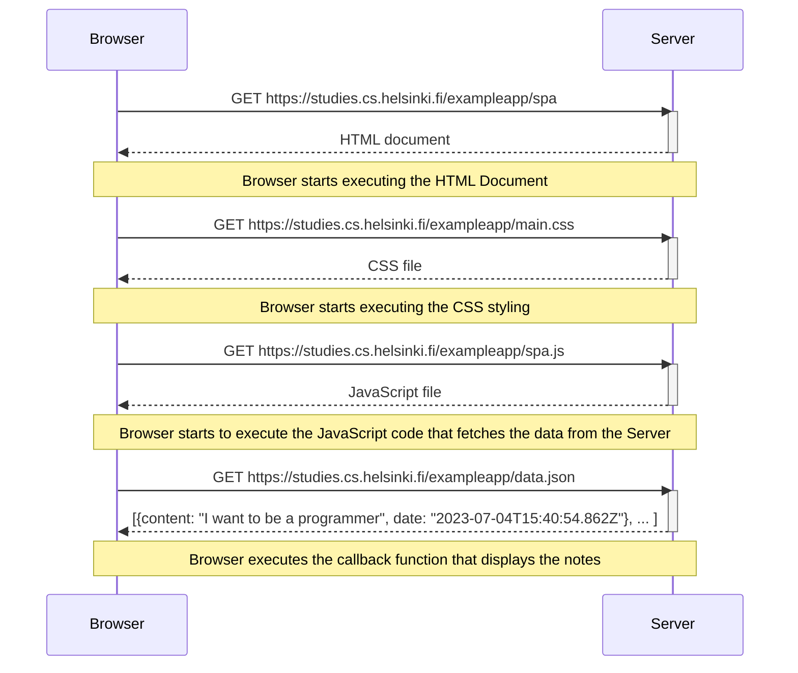

```mermaid
    sequenceDiagram
    
        Browser->>Server: GET https://studies.cs.helsinki.fi/exampleapp/spa
        activate Server
        Server-->>Browser: HTML document
        deactivate Server
        Note over Browser, Server: Browser starts executing the HTML Document

        Browser->>Server: GET https://studies.cs.helsinki.fi/exampleapp/main.css
        activate Server
        Server-->>Browser: CSS file
        deactivate Server
        Note over Browser, Server: Browser starts executing the CSS styling

        Browser->>Server: GET https://studies.cs.helsinki.fi/exampleapp/spa.js
        activate Server
        Server-->>Browser: JavaScript file
        deactivate Server
        Note over Browser, Server: Browser starts to execute the JavaScript code that fetches the data from the Server

        Browser->>Server: GET https://studies.cs.helsinki.fi/exampleapp/data.json
        activate Server
        Server-->>Browser: [{content: "I want to be a programmer", date: "2023-07-04T15:40:54.862Z"}, ... ]
        deactivate Server
        Note over Browser, Server: Browser executes the callback function that displays the notes
```