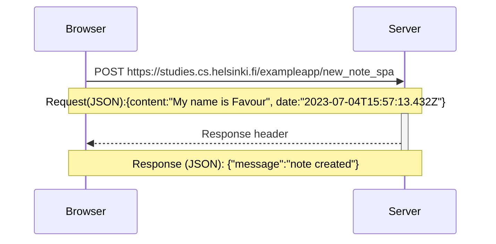

```mermaid
    sequenceDiagram
        
        Browser->>Server: POST https://studies.cs.helsinki.fi/exampleapp/new_note_spa
        Note over Browser, Server: Request(JSON):{content:"My name is Favour", date:"2023-07-04T15:57:13.432Z"}
        activate Server
        Server-->>Browser: Response header
        Note over Browser, Server: Response (JSON): {"message":"note created"}
        deactivate Server
```